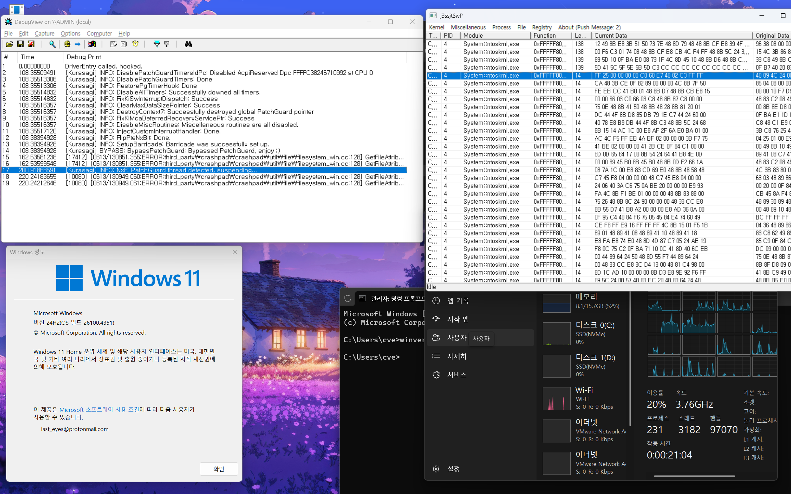

# kurasagi

`kurasagi` is full POC of PatchGuard bypass for Windows 24H2, Build 26100.4351.

For more information, please refer to the `product` branch, which contains the PDF paper detailing the bypass.

**If any BSOD appears which is related to `CRITICAL_STRUCTURE_CORRUPTION` (PatchGuard), please create issue with it!**

## Changelog

(2025/08/03) **Caution**: Upgraded to 26100.4652. for 26100.4351 version bypass, refer to commit `80650b9cb71855042659137ecd8936f8a9336a61`.  
(2025/08/18) **Caution**: Updated to 26100.4946.

## Disclaimers

1. **PLEASE USE IT FOR ONLY EDUCATIONAL PURPOSES!**
2. Do not turn on hypervisor-based security factors when running! (It will BSOD!)
3. Use [kdmapper](https://github.com/TheCruZ/kdmapper) for driver loading.
4. After `kurasagi` has been loaded, we just found there's some weird issue when you allocate pool with `NonPagedPoolExecute` (or `NonPagedPool`, it is same), it is not executable. I'll fix as soon as possible.

# Images

## Credit
Here are the helpful resources I referred to in completing this project. I appreciate these works, ideas, and source codes. Thanks
+ https://blog.tetrane.com/downloads/Tetrane_PatchGuard_Analysis_RS4_v1.01.pdf
+ https://blog.can.ac/2024/06/28/pgc-garbage-collecting-patchguard/
+ https://shhoya.github.io/windows_pgintro.html
